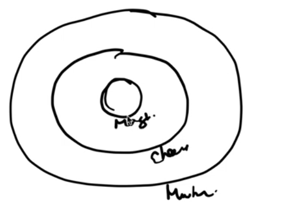

# Decorator Pattern

- Decorator class have both ```"is-a"``` and ```"has-a"``` relationship with base class.
- So it can create as many layer as it want i.e as many inner decorator. 
 
 Here Margherita + ExtraCheeses + Mushroom is a decorator where
1. **Margherita** is inner layer i.e ```base decorator```
2. **ExtraCheese** is next outer layer i.e decorator of ```Margherita```
3. Now **Mushroom** is next outer layer i.e decorator of ```ExtraCheese```

