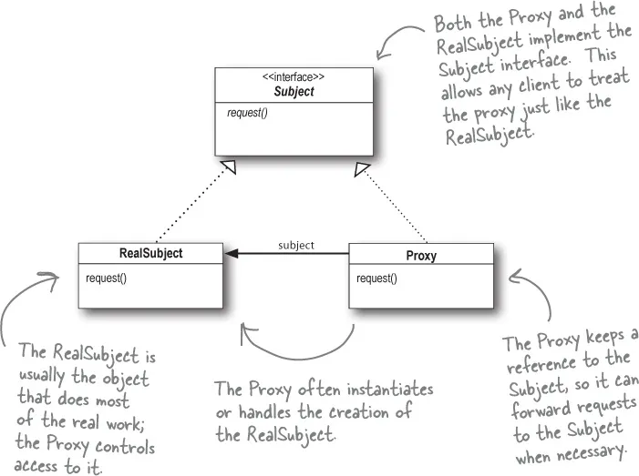

# Proxy Pattern

Proxy pattern allows you to create a proxy or ```intermediary object``` that acts as an interface to another object.

### Use case
1. Access Restriction
2. Caching
3. Pre-processing or Post-processing

### The Proxy pattern consists of several components:

1. ``Proxy``: This is the object that acts as a placeholder for the real object. It implements the same interface as the real object, so the client code can interact with it in the same way. 
2. ```Real Subject```: This is the object that the proxy represents. It's the object that the client code wants to access, but the proxy handles the access to it. 
3. ``Client``: This is the code that uses the proxy to interact with the real object. The client code interacts with the proxy in the same way as it would interact with the real object.

